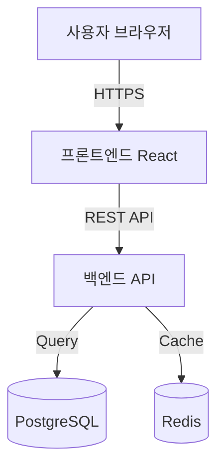
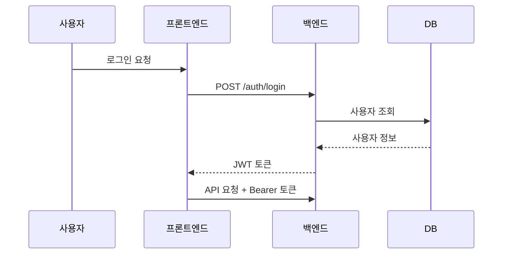

# azure-architecture-pattern

## 목적
클라우드 아키텍처 패턴을 적용하여 확장 가능하고 안정적인 시스템 설계를 지원한다.

## 핵심 패턴

### 단일 서버 (소규모 앱)
```
[사용자] → [Nginx (리버스 프록시)] → [앱 서버] → [DB]
```
- 적용 조건: 동시 사용자 < 100, 기능 < 5개
- Docker Compose 1개 파일로 구성 가능

### API Gateway + 서비스 분리 (중규모)
```
[사용자] → [API Gateway] → [BE 서비스] → [DB]
                        ↘ [파일 스토리지]
```
- 적용 조건: 명확한 도메인 분리, 팀 규모 확대 가능성

### 비동기 처리 패턴
- 긴 작업(파일 처리, 메일 발송): 메시지 큐(Redis/RabbitMQ) 사용
- 실시간 기능: WebSocket (FastAPI/Socket.io 기본 지원)

## Mermaid 다이어그램 템플릿

### 기본 요청 흐름


### 인증 흐름


## 선택 기준
| 요구사항 | 추천 패턴 |
|---------|---------|
| 빠른 프로토타입 | 단일 서버 |
| 파일 업로드 | 오브젝트 스토리지 분리 |
| 실시간 알림 | WebSocket |
| 대용량 처리 | 비동기 큐 |
